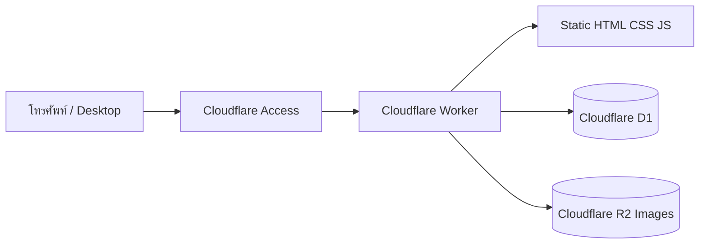

# Technical Specification: Stock Management แบบ Mobile-first บน Cloudflare

**สถานะ:** Draft สำหรับพัฒนา MVP  
**Platform:** Cloudflare Workers + Static Assets + D1 + R2  
**ภาษา:** ไทย (`th-TH`)  
**เขตเวลา:** `Asia/Bangkok`  
**กลุ่มผู้ใช้หลัก:** พนักงานคลังสินค้า ช่าง และผู้ดูแลสต๊อกที่ใช้งานหน้างานผ่านโทรศัพท์

## 1. เป้าหมาย

สร้างเว็บสำหรับดูจำนวนวัสดุ รับเข้า เบิกออก และตรวจนับสต๊อก โดยเน้นใช้งานด้วยมือเดียวบนโทรศัพท์ หน้าตาสดใสหลายสีแต่ใช้สีตามความหมายอย่างสม่ำเสมอ ผู้ใช้ต้องเห็นวัสดุที่ต่ำกว่าจุดสั่งซื้อได้ทันที และตรวจสอบย้อนหลังได้ว่าจำนวนเปลี่ยนเพราะรายการใด

หลักสำคัญคือ **ห้ามแก้จำนวนคงเหลือทับโดยตรง** การเปลี่ยนจำนวนทุกครั้งต้องเกิดจากรายการเคลื่อนไหว ได้แก่ รับเข้า เบิกออก หรือปรับยอดจากการตรวจนับ เพื่อให้มีประวัติที่ตรวจสอบย้อนหลังได้ ระบบต้องใช้ข้อมูลและบริการ Cloudflare ให้น้อยชิ้นที่สุด โดยไม่มีเซิร์ฟเวอร์ถาวร รูปถูกย่อก่อนอัปโหลด และไม่มีตารางสรุปที่ซ้ำกับข้อมูลจริง

## 2. ขอบเขต MVP

### 2.1 ข้อมูลวัสดุ

- Part Number — จำเป็นและห้ามซ้ำ
- รายละเอียด — จำเป็น
- ยี่ห้อ — ไม่บังคับ
- รูปภาพ — ไม่บังคับ จำกัด 1 รูปต่อ Part และย่อก่อนบันทึก
- จำนวนคงเหลือ — ระบบคำนวณจากรายการเคลื่อนไหว
- Min — จำนวนขั้นต่ำที่เริ่มเตือน
- Max — ไม่บังคับ ใช้คำนวณจำนวนแนะนำสำหรับเติมสต๊อก
- หน่วยนับ — ค่าเริ่มต้น `ชิ้น`
- ตำแหน่งเก็บ — ไม่บังคับใน MVP แต่ควรเตรียมคอลัมน์ไว้
- สถานะใช้งาน — ใช้ซ่อนวัสดุที่เลิกใช้โดยไม่ลบประวัติ

### 2.2 งานหลัก

1. ดู Dashboard สรุปจำนวนรายการทั้งหมด, ใกล้ Min, ถึง/ต่ำกว่า Min และหมดสต๊อก
2. ค้นหาวัสดุจาก Part Number, รายละเอียด หรือยี่ห้อ
3. เพิ่มและแก้ไขข้อมูลวัสดุ
4. รับเข้า — เลือกวัสดุ กรอกจำนวน เลขอ้างอิง และหมายเหตุ
5. เบิกออก — เลือกวัสดุ กรอกจำนวน ผู้เบิก/หน่วยงาน และหมายเหตุ
6. เช็คสต๊อก — กรอกจำนวนที่นับได้จริง เปรียบเทียบกับยอดระบบ และยืนยันส่วนต่าง
7. ดูประวัติการเคลื่อนไหวของแต่ละ Part
8. กรองเฉพาะรายการที่ต้องเติมสต๊อก

สิ่งที่ยังไม่รวมใน MVP: หลายคลัง, โอนระหว่างคลัง, lot/serial number, วันหมดอายุ, ใบสั่งซื้อ, หลายรูปต่อ Part, barcode/QR, การแจ้งเตือน LINE/อีเมล และรายงานต้นทุน

## 3. กฎธุรกิจ

### 3.1 สถานะสต๊อก

| เงื่อนไข | สถานะ | การแสดงผล |
|---|---|---|
| `จำนวน = 0` | หมดสต๊อก | สีแดง + ข้อความ `หมดสต๊อก` |
| `0 < จำนวน <= Min` | ต้องเติม | สีส้ม/เหลือง + ข้อความ `ถึงจุดสั่งซื้อ` |
| `Min < จำนวน < Max` หรือไม่ได้กำหนด Max | ปกติ | สีเขียว + ข้อความ `ปกติ` |
| `จำนวน >= Max` เมื่อมี Max | เต็ม/เกิน Max | สีฟ้า + ข้อความ `ถึงระดับสูงสุด` |

- ระบบต้องเตือนเมื่อ `จำนวนคงเหลือ <= Min` ไม่ใช่เฉพาะตอนต่ำกว่า Min
- ถ้ามี Max ให้แสดง `จำนวนแนะนำให้เติม = Max - จำนวนคงเหลือ`
- ต้องกำหนด `Min >= 0`; ถ้ามี Max ต้องเป็น `Max > Min`
- การรับเข้าและเบิกออกรับเฉพาะจำนวนมากกว่า 0
- อนุญาตให้เบิกออกจนยอดคงเหลือติดลบได้ (Negative Stock) ตามมติ Phase 0 เพื่อรองรับการเบิกของฉุกเฉินหน้างาน โดยระบบจะขึ้นป้ายสถานะเตือน "ติดลบ" และจัดลำดับเป็นรายการต้องเติมด่วนที่สุด
- วัสดุที่ถูกปิดใช้งานยังเปิดดูประวัติได้ แต่ห้ามสร้างรายการรับเข้า/เบิกออกใหม่

### 3.2 ความถูกต้องของยอด

- Backend ต้องคำนวณ `ยอดก่อน`, `จำนวนเปลี่ยนแปลง` และ `ยอดหลัง` ภายใต้ lock เดียวกัน
- รับเข้า/เบิกออกต้องรอคำยืนยันจาก Server ก่อนแสดงว่าสำเร็จ
- ทุกคำสั่งเขียนข้อมูลมี `Request ID` ไม่ซ้ำ เพื่อป้องกันกดซ้ำหรือเครือข่าย retry แล้วเกิดรายการซ้ำ
- ห้ามลบ Transaction ที่บันทึกแล้ว หากผิดให้สร้างรายการย้อนกลับพร้อมเหตุผล
- รายการตรวจนับที่ยืนยันแล้วสร้าง Transaction ประเภท `ADJUST_IN` หรือ `ADJUST_OUT` ตามส่วนต่าง

## 4. User Flow

### 4.1 รับเข้า

1. แตะปุ่ม `รับเข้า`
2. ค้นหา/เลือก Part Number
3. แสดงยอดปัจจุบันและ Min/Max ก่อนกรอก
4. กรอกจำนวนรับเข้า เลขอ้างอิง และหมายเหตุ
5. แตะ `ยืนยันรับเข้า`
6. ปุ่มแสดงสถานะกำลังบันทึกและกดซ้ำไม่ได้
7. เมื่อ Server ยืนยัน แสดงยอดใหม่และข้อความสำเร็จ

### 4.2 เบิกออก

1. แตะปุ่ม `เบิกออก`
2. ค้นหา/เลือก Part Number
3. แสดงยอดพร้อมสถานะสต๊อก
4. กรอกจำนวน ผู้เบิก/หน่วยงาน และหมายเหตุ
5. ถ้าจำนวนเกินยอดคงเหลือ ให้แสดงป้ายเตือน "ยอดจะติดลบหลังเบิก" ในฟอร์ม แต่ยังอนุญาตให้ส่งคำสั่งได้
6. แตะ `ยืนยันเบิกออก`
7. เมื่อ Server ยืนยัน แสดงยอดใหม่; ถ้ายอดใหม่ถึง Min ให้แสดงคำเตือนทันที

### 4.3 เช็คสต๊อก

1. เปิดเมนู `เช็คสต๊อก`
2. เลือกตรวจนับทั้งหมด หรือค้นหาเฉพาะ Part
3. แต่ละรายการแสดง Part Number, รายละเอียด, ตำแหน่งเก็บ และช่อง `จำนวนที่นับได้`
4. ระบบคำนวณ `ส่วนต่าง = จำนวนที่นับได้ - จำนวนในระบบ`
5. หน้าทบทวนแยก `ตรงกัน`, `เกิน`, และ `ขาด`
6. รายการที่มีส่วนต่างต้องกรอกเหตุผลก่อนยืนยัน
7. ยืนยันครั้งเดียวแล้วระบบสร้าง Transaction ปรับยอดให้แต่ละรายการ
8. เก็บเลขรอบตรวจนับ ผู้ตรวจ เวลา และผลรวมส่วนต่าง

หากออกจากหน้าระหว่างตรวจนับ ให้เก็บ Draft ในเครื่องและแจ้งให้ผู้ใช้เลือกกลับมาทำต่อหรือทิ้ง Draft โดย Draft ต้องไม่เปลี่ยนยอดจริงจนกว่าจะยืนยัน

## 5. หน้าจอและโครงสร้างนำทาง

ใช้ Bottom navigation 4 เมนูบนโทรศัพท์:

1. `หน้าหลัก` — Dashboard และรายการเตือน
2. `วัสดุ` — ค้นหา รายการ และรายละเอียด
3. `เคลื่อนไหว` — รับเข้า เบิกออก และประวัติ
4. `เช็คสต๊อก` — เริ่ม/ทำต่อ/ดูผลตรวจนับ

บน Desktop เปลี่ยน Bottom navigation เป็น Sidebar แต่ใช้ชื่อเมนูและพฤติกรรมเดิม

### หน้าหลัก

- ส่วนหัวทักทายสั้น ๆ และเวลาอัปเดตล่าสุด
- การ์ดสรุป 4 สี: วัสดุทั้งหมด, ต้องเติม, หมดสต๊อก, รายการวันนี้
- ปุ่มใหญ่ `รับเข้า` สีเขียว และ `เบิกออก` สีส้มแดง
- รายการ `ต้องเติมด่วน` เรียงจากหมดสต๊อกก่อน แล้วตามสัดส่วนจำนวนต่อ Min

### หน้าวัสดุ

- Search bar แบบ sticky พร้อมปุ่มล้างคำค้น
- Filter chips: ทั้งหมด, ปกติ, ถึง Min, หมดสต๊อก
- มือถือใช้การ์ดหนึ่งคอลัมน์ ไม่บีบตาราง
- การ์ดแสดง Part Number เด่นที่สุด ตามด้วยรายละเอียด, ยี่ห้อ, จำนวน, Min และป้ายสถานะ
- Desktop ใช้ตาราง แบ่งหน้า 25/50/100 รายการ และเก็บ search/filter/page ใน URL

### ฟอร์ม

- เปิดเป็นหน้าเต็มหรือ Bottom Sheet บนโทรศัพท์
- ช่องกรอกเรียงหนึ่งคอลัมน์
- ปุ่มหลักติดด้านล่างโดยเผื่อ safe area และต้องไม่ถูกคีย์บอร์ดบัง
- ช่องจำนวนใช้ numeric keyboard และปุ่มลด/เพิ่มเป็นตัวช่วย แต่ยังพิมพ์ค่าได้
- ทุกปุ่มและพื้นที่แตะอย่างน้อย `48 × 48px`

### รูปภาพวัสดุ

- เลือกจากกล้องหรือคลังภาพบนโทรศัพท์; Desktop เพิ่ม Drag & Drop และวางจาก Clipboard ได้
- รับต้นฉบับ JPEG, PNG หรือ WebP ไม่เกิน 10 MB
- Browser แก้ orientation, ลดด้านยาวไม่เกิน 1,280 px และแปลงเป็น WebP คุณภาพประมาณ 0.75
- เป้าหมายไฟล์หลังย่อไม่เกิน 350 KB; ถ้ายังเกินให้ลดคุณภาพ/ขนาดเป็นรอบจนถึงเป้าหมาย
- แสดง Preview พร้อมขนาดก่อนและหลังย่อก่อนกดบันทึก
- Backend ตรวจชนิดไฟล์จริงและขนาดซ้ำ ไม่เชื่อ MIME จาก Client
- ใช้ภาพ placeholder เมื่อไม่มีรูปหรือโหลดรูปไม่สำเร็จ โดยไม่ทำให้การรับเข้า/เบิกออกถูกบล็อก

## 6. แนวทางภาพลักษณ์

แนวคิดคือ **“ป้ายจัดหมวดสีสดในคลังที่อ่านได้ในพริบตา”** พื้นหลังใช้สีครีมอมฟ้าสว่างและใช้สีหลายสีในบทบาทที่ชัดเจน ไม่ใช้สีรุ้งกับข้อมูลทุกจุดจนแยกสถานะไม่ออก

| บทบาท | สีแนะนำ | การใช้งาน |
|---|---|---|
| Brand / Navigation | น้ำเงินสด `#2563EB` | เมนู, focus, ปุ่มทั่วไป |
| รับเข้า / Success | เขียว `#16A66A` | รับเข้า, บันทึกสำเร็จ |
| เบิกออก | ส้มแดง `#F06449` | ปุ่มเบิกออก |
| เตือน Min | เหลืองอำพัน `#F4B740` | ถึง Min, ต้องเติม |
| หมดสต๊อก / Error | แดง `#D93D58` | จำนวน 0, ข้อผิดพลาด |
| เช็คสต๊อก | ม่วง `#7C5CE7` | รอบตรวจนับและส่วนต่าง |
| พื้นหลัง | `#F6F8FC` | ลดความล้าตา |
| ตัวอักษรหลัก | `#17233C` | Contrast สูง |

- ฟอนต์ไทยใช้ `Prompt` เมื่อโหลดได้ และ fallback เป็น `Leelawadee UI`, Tahoma, sans-serif
- จำนวนใช้เลขแบบ tabular เพื่อเทียบค่าง่าย
- มุมโค้ง 14–18px สำหรับการ์ด แต่ input/button ใช้ 10–12px
- สีไม่ใช่สัญญาณเดียว ทุกสถานะต้องมีข้อความและไอคอน
- Motion สั้น 150–200ms และปิดได้เมื่อผู้ใช้เลือก reduced motion
- เป้าหมาย WCAG 2.2 AA และรองรับขนาดหน้าจอ 320px ขึ้นไปโดยไม่มี horizontal scroll ทั้งหน้า

## 7. โครงสร้างข้อมูล D1 แบบประหยัดพื้นที่

ใช้ SQLite/D1 หนึ่งฐานข้อมูลและใช้ `INTEGER PRIMARY KEY` เป็น ID ภายในทุกตาราง ไม่เก็บ UUID ซ้ำในทุกแถว ยกเว้น `request_key` ที่ต้องรับจาก Client เพื่อป้องกันคำสั่งซ้ำ เวลาเก็บเป็น Unix epoch วินาที และจำนวนเก็บเป็น Integer เพื่อประหยัดพื้นที่และหลีกเลี่ยงความคลาดเคลื่อนของเลขทศนิยม

ถ้าหน่วยนับในอนาคตต้องมีทศนิยม ให้เก็บเป็น scaled integer เช่น `1250 = 1.250` แทน `REAL`

### Table: `brands`

| Column | Type | กติกา |
|---|---|---|
| `id` | INTEGER PK | ID ภายใน |
| `name` | TEXT UNIQUE | ชื่อยี่ห้อหลัง normalize |

แยกยี่ห้อออกเป็นตารางเล็กเพื่อไม่เก็บชื่อเดิมซ้ำใน Part หลายพันแถว

### Table: `parts`

| Column | Type | กติกา |
|---|---|---|
| `id` | INTEGER PK | ID ภายใน ไม่แสดงเป็นรหัสธุรกิจ |
| `part_no` | TEXT UNIQUE | จำเป็นและ normalize ก่อนบันทึก |
| `description` | TEXT | จำเป็น |
| `brand_id` | INTEGER/null | FK ไป `brands` |
| `qty` | INTEGER | ยอดปัจจุบัน อัปเดตผ่าน Movement เท่านั้น |
| `min_qty` | INTEGER | `>= 0` |
| `max_qty` | INTEGER/null | ถ้ามีต้อง `> min_qty` |
| `unit` | TEXT | ค่าเริ่มต้น `ชิ้น` |
| `location` | TEXT/null | ไม่บังคับ |
| `image_key` | TEXT/null | Object key สั้นใน R2; ไม่เก็บ URL หรือ Base64 |
| `active` | INTEGER | `1` ใช้งาน, `0` ปิดใช้งาน |
| `version` | INTEGER | เพิ่มทุกครั้งที่ยอดหรือข้อมูลเปลี่ยน |
| `created_at`, `updated_at` | INTEGER | Unix epoch วินาที |

### Table: `users`

เก็บเพียง `id`, `email UNIQUE` และ `display_name` เพื่อไม่เขียนอีเมลเดิมซ้ำในประวัติทุกแถว ตัวตนมาจาก Cloudflare Access; ระบบไม่เก็บรหัสผ่าน

### Table: `movements`

| Column | Type | กติกา |
|---|---|---|
| `id` | INTEGER PK | รหัสรายการเรียงลำดับ |
| `request_key` | TEXT UNIQUE | ป้องกันคำสั่งซ้ำ |
| `part_id` | INTEGER | FK ไป `parts` |
| `kind` | INTEGER | `1=รับเข้า`, `2=เบิกออก`, `3=ปรับยอด`, `4=ย้อนรายการ` |
| `delta` | INTEGER | จำนวนมีเครื่องหมาย เช่น `+10`, `-3` |
| `reference` | TEXT/null | เลขเอกสารหรือผู้เบิก |
| `note` | TEXT/null | เก็บเมื่อมีข้อมูลเท่านั้น |
| `count_id` | INTEGER/null | อ้างอิงรอบตรวจนับ |
| `actor_id` | INTEGER | FK ไป `users` |
| `created_at` | INTEGER | Unix epoch วินาที |

ไม่เก็บ `before_qty`, `after_qty`, `quantity` และ `difference` ซ้ำในตารางนี้ ยอดปัจจุบันอ่านจาก `parts.qty`; ประวัติการเปลี่ยนแปลงอ่านจาก `delta`; ยอด ณ เวลาใดเวลาหนึ่งคำนวณได้จากผลรวม ledger เมื่อต้องตรวจสอบ

### Table: `stock_counts`

เก็บเฉพาะหัวรอบ: `id`, `status` แบบ integer, `actor_id`, `started_at`, `completed_at` และ `note` ไม่มีตารางสรุปยอดซ้ำ

### Table: `stock_count_lines`

เก็บ `count_id`, `part_id`, `system_qty`, `counted_qty` และ `reason` โดยใช้ `(count_id, part_id)` เป็น composite primary key ค่า `difference` คำนวณจาก `counted_qty - system_qty` ไม่เก็บซ้ำ ต้องเก็บแถวที่ยอดตรงกันด้วยเพื่อยืนยันว่า Part นั้นถูกตรวจแล้วจริง

### Index ที่จำเป็นเท่านั้น

- Unique index ของ `parts.part_no`, `brands.name`, `users.email`, `movements.request_key`
- `movements(part_id, created_at DESC)` สำหรับประวัติราย Part
- Partial index สำหรับ Part ที่ใช้งานและถึง Min เพื่อให้ Dashboard ไม่สแกนทั้งตาราง
- `stock_count_lines(count_id)` มีอยู่แล้วจาก composite primary key

ไม่สร้าง index ทุกคอลัมน์ เพราะ index เพิ่มทั้งพื้นที่และจำนวน row writes ให้เพิ่มเมื่อ `EXPLAIN QUERY PLAN` และ D1 metrics แสดงว่าจำเป็นจริง

## 8. สถาปัตยกรรม Cloudflare แบบชิ้นส่วนน้อยที่สุด

ใช้บริการหลักเพียง 4 ส่วน:

1. **Workers Static Assets** — เสิร์ฟ HTML/CSS/JavaScript จาก deployment เดียวกับ API
2. **Cloudflare Worker** — TypeScript API ที่ `/api/*`, validation, authentication และ business rules
3. **D1** — SQLite database หนึ่งก้อนสำหรับ Part, ledger และ stock count
4. **R2** — Private bucket เก็บรูปที่ย่อแล้ว 1 รูปต่อ Part

ไม่ใช้ Pages แยก, KV, Durable Objects, Queue หรือ framework ฝั่ง Client ใน MVP ใช้ HTML semantic + CSS + TypeScript ขนาดเล็ก; build ด้วย Vite เฉพาะการ minify และ hash assets

Cloudflare Access ป้องกันทั้งเว็บและ API โดยใช้อีเมลองค์กรหรือ OTP ผู้ใช้ API ต้องผ่านการตรวจลายเซ็น `Cf-Access-Jwt-Assertion` ใน Worker จึงไม่ต้องสร้างตาราง session หรือเก็บ password เอง

### ความถูกต้องของยอดใน D1

- ใช้ SQLite trigger ตรวจ `delta != 0`, Part ยัง active และคำนวณปรับยอดใหม่ (ยอมรับยอดติดลบได้)
- Trigger เป็นเจ้าของการเพิ่ม `parts.qty` และ `parts.version`; API ห้าม `UPDATE qty` โดยตรง
- `request_key UNIQUE` ทำให้ retry คำสั่งเดิมไม่เกิด Movement ซ้ำ
- ยืนยัน Stock Count ด้วย `INSERT INTO movements ... SELECT ... FROM stock_count_lines` และปิดรอบใน `D1Database.batch()` เดียว เพื่อให้สำเร็จหรือ rollback ทั้งชุด
- D1 `batch()` ทำงานเป็น transaction และ rollback ทั้ง batch เมื่อ statement ล้มเหลว
- ใช้ D1 Time Travel เป็นการกู้คืนระยะสั้น และ export SQLite เป็นระยะเมื่อองค์กรต้องการเก็บสำรองนานกว่าระยะของแผน

### ลดข้อมูลและทราฟฟิก

- API ส่งเฉพาะฟิลด์ที่หน้าปัจจุบันใช้ ไม่ใช้ `SELECT *`
- ใช้ cursor pagination (`id < cursor`) แทน offset ลึก ๆ สำหรับ Movement
- หน้า Part ใช้ page size 25; Dashboard ส่งเฉพาะ count และ low-stock 10 รายการแรก
- Search Part Number แบบ exact/prefix ซึ่งใช้ index; ค้น description แบบ substring ให้ทำเมื่อผู้ใช้กด Enter เพื่อไม่สแกนซ้ำทุกตัวอักษร
- Cache เฉพาะ static assets ที่ edge; ห้าม cache response ยอดสต๊อกที่อาจเก่า
- เก็บใน D1 เพียง `image_key`; ไฟล์รูปจริงอยู่ R2 และห้ามเก็บ Base64/blob ใน D1
- R2 bucket เป็น private และอ่านรูปผ่าน Worker หลังตรวจ Access JWT
- เปลี่ยนรูปด้วยลำดับ: อัปโหลดรูปใหม่ → อัปเดต `image_key` ใน D1 → ลบรูปเดิม; ถ้า D1 ล้มเหลวให้ลบรูปใหม่ทันที
- ไม่เก็บ thumbnail แยกใน MVP เพราะรูปหลักถูกย่อไว้แล้ว
- ไม่เก็บ HTML snapshot, dashboard aggregate หรือ log debug ใน D1
- ข้อความว่างบันทึกเป็น `NULL` เมื่อไม่จำเป็น

## 9. HTTP API

ทุก mutation รับ header `Idempotency-Key` และตอบ JSON รูปแบบเดียวกัน `{ data, error, requestId }`

| Method / Path | หน้าที่ |
|---|---|
| `GET /api/dashboard` | จำนวนสรุปและ low-stock 10 รายการ |
| `GET /api/parts` | ค้นหา กรอง และแบ่งหน้า |
| `POST /api/parts` | เพิ่มวัสดุ |
| `GET /api/parts/:id` | รายละเอียด Part |
| `PATCH /api/parts/:id` | แก้ข้อมูลโดยใช้ `If-Match`/version |
| `PUT /api/parts/:id/image` | อัปโหลดรูปที่ย่อแล้วไป R2 และแทนรูปเดิม |
| `GET /api/parts/:id/image` | อ่านรูปจาก private R2 หลังตรวจสิทธิ์ |
| `DELETE /api/parts/:id/image` | ลบรูปและล้าง `image_key` |
| `POST /api/parts/:id/receive` | รับเข้า |
| `POST /api/parts/:id/issue` | เบิกออก |
| `GET /api/parts/:id/movements` | ประวัติแบบ cursor pagination |
| `POST /api/counts` | เริ่ม Draft รอบตรวจนับ |
| `PUT /api/counts/:id/lines/:partId` | บันทึกผลนับทีละ Part |
| `POST /api/counts/:id/complete` | ปรับยอดและปิดรอบแบบ atomic |
| `GET /api/counts/:id` | สรุปผลตรวจนับ |
| `POST /api/admin/reconcile` | เทียบ `parts.qty` กับผลรวม Movement |

## 10. สถานะ UI ที่ต้องออกแบบ

- Loading แบบรักษาพื้นที่เดิม ไม่ทำให้หน้ากระโดด
- Empty: ยังไม่มีวัสดุ พร้อมปุ่มเพิ่มรายการแรก
- No results: ไม่พบคำค้น พร้อมปุ่มล้าง Filter
- Low stock และ Out of stock
- Saving และป้องกันกดซ้ำ
- Validation error แบบชี้ช่องและบอกวิธีแก้
- Network timeout ที่ผลลัพธ์อาจไม่แน่นอน: refresh สถานะก่อนให้ส่งซ้ำ
- Stale/version conflict: แจ้งว่ามียอดเปลี่ยนจากอีกเครื่องและให้โหลดข้อมูลล่าสุด
- Draft stock count ที่ยังไม่ยืนยัน
- Partial error เมื่อยืนยันรอบตรวจนับไม่ได้ โดยต้องไม่เกิดการปรับยอดครึ่งรอบ

## 11. แผนพัฒนาเป็นระยะ

### Phase 0 — ยืนยันกฎก่อนเริ่ม

- ยืนยันว่าจะอนุญาตยอดติดลบหรือไม่ — อนุญาต
- ยืนยันว่าใครมีสิทธิ์ปรับยอดจากเช็คสต๊อก - ทุกคนยังไม่มีระบบล็อกอิน
- ยืนยันว่า Max จำเป็นทุก Part หรือเป็นค่าเสริม — แผนนี้ตั้งต้นว่าเป็นค่าเสริม
- ยืนยันรูปแบบผู้เบิก/เลขเอกสารที่ต้องเก็บ
- ตัดสินใจว่าจะ import Part master เริ่มฐานใหม่

### Phase 1 — Foundation

- สร้าง Cloudflare Worker, Static Assets และ D1 migrations
- สร้าง Schema, constraints, indexes เท่าที่จำเป็น และ trigger เจ้าของยอด
- สร้าง Core functions สำหรับคำนวณสถานะและตรวจคำสั่ง Movement
- เขียน unit tests สำหรับ Min/Max, เบิกเกิน, Request ID ซ้ำ และ version conflict
- สร้าง `DESIGN.md`, `UX-CONTRACT.md` และ canonical shared components

### Phase 2 — วัสดุและ Dashboard

- CRUD วัสดุแบบ soft delete
- Search/filter/server pagination
- Dashboard และรายการเตือน Min
- Mobile cards และ Desktop table
- เลือกรูป, ย่อ/แปลง WebP, Preview และจัดเก็บใน private R2

### Phase 3 — รับเข้า/เบิกออก

- Movement ledger, trigger และ idempotency
- ฟอร์มรับเข้า/เบิกออกที่ใช้ร่วมกัน
- ประวัติราย Part และประวัติรวม
- ทดสอบการกดซ้ำ คำสั่งชนกัน และ timeout

### Phase 4 — เช็คสต๊อก

- สร้าง/พัก/ทำต่อรอบตรวจนับ
- เปรียบเทียบยอดและหน้าทบทวนส่วนต่าง
- ยืนยันปรับยอดแบบ all-or-nothing
- รายงานผลการตรวจนับและ trace ไปยัง Transaction

### Phase 5 — Hardening และ Deploy

- ทดสอบมือถือจริง 320px, 375px, 430px และ Desktop
- ทดสอบ keyboard, focus, screen reader labels และ contrast
- ทดสอบ loading, empty, error, offline/timeout, stale data และ reduced motion
- รัน formatter, tests, build และ premium UI audit
- ทดสอบ D1 migrations บนฐาน Preview ก่อน Production
- ตรวจ `EXPLAIN QUERY PLAN`, D1 rows read/written และขนาดฐานข้อมูล
- ตั้ง Cloudflare Access policy, Custom Domain และ Time Travel runbook
- Pilot กับผู้ใช้งานหน้างาน และเก็บเวลาที่ใช้ต่อรายการ

## 12. Acceptance Criteria

- เปิดและทำงานหลักได้บนโทรศัพท์โดยไม่มี horizontal scroll ทั้งหน้า
- เพิ่ม Part Number, รายละเอียด, ยี่ห้อ, Min และ Max ได้ตามกฎ
- เลือกรูปจากโทรศัพท์และเห็น Preview ก่อนบันทึกได้
- รูปที่ส่งไป R2 มีด้านยาวไม่เกิน 1,280 px และเป้าหมายขนาดไม่เกิน 350 KB
- D1 เก็บเพียง `image_key` และไม่มี Base64/blob ของรูป
- การเปลี่ยนรูปไม่ทิ้งไฟล์ใหม่เมื่อ D1 บันทึกไม่สำเร็จ
- Part Number ซ้ำถูกปฏิเสธทั้ง Client และ Server
- รับเข้าเพิ่มยอดถูกต้องและสร้าง Transaction หนึ่งรายการ
- เบิกออกลดยอดถูกต้องและอนุญาตให้ติดลบได้พร้อมแสดง Badge ติดลบและแจ้งเตือนบน Dashboard
- คำสั่ง Request ID เดิมไม่เปลี่ยนยอดซ้ำ
- เมื่อยอดหลังทำรายการ `<= Min` หน้าเว็บแสดงเตือนทันที
- เมื่อมี Max ระบบคำนวณจำนวนแนะนำให้เติมได้ถูกต้อง
- การตรวจนับแสดงยอดระบบ ยอดนับจริง และส่วนต่างถูกต้อง
- การยืนยันตรวจนับสร้าง Adjustment และปิดรอบโดยไม่เกิดผลสำเร็จครึ่งชุด
- ทุกการเปลี่ยนยอดย้อนดูผู้ทำ เวลา ค่าเปลี่ยนแปลง และเหตุผลได้ พร้อมคำนวณยอดย้อนหลังได้
- รายการ 10,000 Part ยังค้นหาและแบ่งหน้าโดยไม่โหลดทั้งหมดเข้า Browser
- เว็บและ API Deploy จาก Worker เดียว และฐานข้อมูลอยู่ใน D1 เพียงหนึ่งฐาน
- D1 ไม่มีข้อมูลรูป, snapshot หรือยอดสรุปซ้ำที่คำนวณจากตารางหลักได้
- การเรียก Movement ซ้ำด้วย `Idempotency-Key` เดิมไม่เปลี่ยนยอดซ้ำ
- API ปฏิเสธ JWT ที่ไม่ถูกต้องหรือไม่ได้รับอนุญาต
- ทุก action มี loading, success, validation error และ retry/recovery ที่เหมาะสม

## 13. ข้อสรุปจากการทบทวนแผน

แนวทางที่เล็กและปลอดภัยที่สุดคือ **Worker เดียว + Static Assets + D1 เดียว + private R2 bucket เดียว** และไม่สร้างระบบแก้จำนวนคงเหลือโดยตรง ใช้ Part master + Movement delta + Stock Count adjustment ตั้งแต่ต้น เพราะรับเข้า เบิกออก เช็คสต๊อก และแจ้งเตือน Min ใช้กฎเดียวกันทั้งหมด รูปถูกย่อใน Browser และ D1 เก็บเพียง object key จึงไม่ทำให้ฐานข้อมูลหลักโตเร็ว

การเก็บ `parts.qty` ซ้ำกับผลรวม Movement เพิ่มข้อมูลเพียง Integer หนึ่งค่าต่อ Part แต่ลดการอ่านประวัติทุกแถวในทุกหน้ารายการ จึงเบากว่าทั้งด้าน latency และจำนวน D1 rows read ส่วน Movement เก็บเพียง `delta` ไม่เก็บยอดก่อน/หลังซ้ำ

จุดที่ต้องตัดสินใจก่อนลงมือจริงมีเพียงสิทธิ์ผู้ปรับยอด รูปแบบเลขอ้างอิง รายชื่อผู้ใช้ Cloudflare Access และการนำเข้า Part master เดิม

## 14. ข้อจำกัดและแหล่งอ้างอิง Cloudflare

- Workers Static Assets deploy หน้าเว็บและ Worker พร้อมกัน และเสิร์ฟ static asset จาก edge cache: [Cloudflare Workers Static Assets](https://developers.cloudflare.com/workers/static-assets/)
- Static asset requests ไม่มีค่าใช้จ่ายเพิ่มเติมตามเอกสารปัจจุบัน ส่วน `/api/*` จึงค่อยเรียก Worker: [Static Assets billing and limitations](https://developers.cloudflare.com/workers/static-assets/billing-and-limitations/)
- D1 Free มีเพดานฐานละ 500 MB และ Time Travel 7 วัน ณ วันที่จัดทำแผน; Paid มีเพดานฐานละ 10 GB และ Time Travel 30 วัน: [D1 limits](https://developers.cloudflare.com/d1/platform/limits/)
- D1 คิดการใช้งานจาก rows read/written จึงต้องใช้ index เท่าที่จำเป็นและหลีกเลี่ยง full scan: [D1 pricing](https://developers.cloudflare.com/d1/platform/pricing/) และ [Use indexes](https://developers.cloudflare.com/d1/best-practices/use-indexes/)
- `D1Database.batch()` เป็น transaction และ rollback ทั้งลำดับเมื่อ statement ล้มเหลว: [D1 Database API](https://developers.cloudflare.com/d1/worker-api/d1-database/)
- Cloudflare Access ส่งตัวตนผ่าน JWT และ Worker ต้องตรวจ `Cf-Access-Jwt-Assertion`: [Validate Access JWTs](https://developers.cloudflare.com/cloudflare-one/access-controls/applications/http-apps/authorization-cookie/validating-json/)
- D1 Time Travel เปิดใช้งานอัตโนมัติ แต่การเก็บสำรองระยะยาวต้องมี export policy แยก: [Time Travel and backups](https://developers.cloudflare.com/d1/reference/time-travel/)
- รูปเก็บเป็น object ใน private bucket และ Worker เข้าถึงผ่าน R2 binding: [Cloudflare R2](https://developers.cloudflare.com/r2/)
