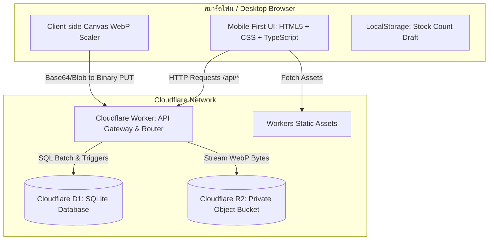

# Technical Specification: ระบบบริหารสต๊อกวัสดุ Mobile-First (Cloudflare Stack)

**Status**: Ready for Implementation (Aligned with Phase 0 Decisions)  
**Version**: 1.0.0  
**Target Platform**: Cloudflare Workers + Static Assets + D1 (SQLite) + R2 Object Storage  
**Target Audience**: พนักงานคลังสินค้า, ช่างซ่อมบำรุง, และผู้ควบคุมพัสดุ (ใช้งานผ่านสมาร์ตโฟนหน้างาน)  
**Language & Locale**: ไทย (`th-TH`), Timezone: `Asia/Bangkok` (`UTC+7`)  

---

## 1. Executive Summary & Goals

### 1.1 Objective
พัฒนาระบบ Web Application สำหรับตรวจสอบ ดูยอดคงเหลือ รับเข้า เบิกออก และตรวจนับสต๊อกวัสดุ ออกแบบเพื่อการใช้งานด้วยมือเดียวบนโทรศัพท์มือถือเป็นหลัก (Mobile-First Ergonomics) เน้นความรวดเร็ว โหลดไว ไม่หน่วงเครื่อง สถาปัตยกรรมทำงานแบบ Serverless 100% บน Cloudflare โดยไม่มีเซิร์ฟเวอร์แบบเปิดทิ้งไว้

### 1.2 Core Architectural Principles (หลักการสำคัญ)
1. **Ledger-Only Truth (ห้ามแก้ไขยอดคงเหลือโดยตรง)**: ยอดคงเหลือใน `parts.qty` ถูกอัปเดตผ่าน SQLite Trigger ที่ผูกกับตาราง `movements` เท่านั้น ห้าม API ทำการ `UPDATE parts SET qty = ...` ตรงๆ เด็ดขาด ทุกการเปลี่ยนแปลงต้องมีหลักฐาน Movement เสมอ
2. **Allow Negative Stock (อนุญาตยอดคงเหลือติดลบ)**: ตามมติ Phase 0 ในสถานการณ์หน้างานจริง ช่างอาจจำเป็นต้องเบิกของไปใช้งานฉุกเฉินก่อนทำเอกสารรับเข้า ระบบจะอนุญาตให้เบิกออกจนยอดติดลบได้ พร้อมแสดงสถานะเตือนพิเศษ "ติดลบ" (Negative Stock) อย่างชัดเจน
3. **No Auth MVP with Auditable Sign-off (ใช้งานได้ทันทีโดยไม่ต้องล็อกอิน)**: ในระยะ MVP เริ่มต้นยังไม่เปิดระบบล็อกอิน (No Auth) เพื่อความคล่องตัวในการนำไปใช้หน้างานทันที แต่ทุกฟอร์มบันทึก (รับเข้า, เบิกออก, ปรับยอดตรวจนับ) **ต้องบังคับระบุชื่อผู้ทำรายการ** เพื่อบันทึกลงใน Movement Record ให้ตรวจสอบย้อนหลังได้เสมอ
4. **Lightweight & High Aesthetic**: ไม่ใช้เฟรมเวิร์กขนาดใหญ่ รันบน HTML Semantic + Vanilla CSS/Tailwind tokens + Vanilla TypeScript (Vite bundler สำหรับ minify/hash) ภาพถ่ายถูกย่อและแปลงเป็น WebP บนเบราว์เซอร์ก่อนส่งเข้า R2 เพื่อประหยัด Bandwidth และ Storage

### 1.3 Success Metrics
- First Contentful Paint (FCP) < 0.6 วินาที บนเครือข่าย 4G มือถือ
- เวลาในการบันทึกรับเข้า/เบิกออก < 3 วินาที (นับตั้งแต่แตะปุ่มจนบันทึกสำเร็จ)
- ขนาดไฟล์รูปภาพที่จัดเก็บเฉลี่ย < 200 KB ต่อภาพ (ไม่เกิน 350 KB)
- Zero Data Inconsistency ระหว่างตาราง `parts.qty` และผลรวม `SUM(movements.delta)`

### 1.4 Non-Goals (สิ่งที่อยู่นอกเหนือขอบเขต MVP)
- ระบบจัดการหลายคลังสินค้า (Multi-warehouse) และการโอนย้ายระหว่างคลัง
- ระบบ Lot Number, Serial Number, วันหมดอายุ
- ระบบใบสั่งซื้อ (PO / PR Workflow) และระบบคำนวณมูลค่าทางบัญชี (FIFO/LIFO/Average Cost)
- ระบบอ่านบาร์โค้ดผ่านกล้องในตัว (MVP ค้นหาด้วยคีย์เวิร์ด/Part Number ก่อน)
- ระบบแจ้งเตือนภายนอก (LINE Notify / Email Dispatcher)

---

## 2. User Experience & Frontend Design System

อิงตามแนวทาง `/frontend-design` สไตล์ **"Industrial & Technical Precision ผสานป้ายสีสถานะคลังสินค้าสดใส (Vibrant Warehouse Semantics)"**

### 2.1 Design Tokens (CSS Custom Properties)

```css
:root {
  /* Surface & Base - Warm Neutral for reduced eye fatigue */
  --bg-app: hsl(220, 20%, 97%);           /* #f4f6fa */
  --bg-surface: hsl(0, 0%, 100%);          /* #ffffff */
  --bg-surface-elevated: hsl(220, 25%, 98%);
  --border-subtle: hsl(220, 15%, 88%);
  --border-strong: hsl(220, 15%, 72%);

  /* Ink & Typography */
  --text-primary: hsl(222, 47%, 11%);       /* #0f172a */
  --text-secondary: hsl(215, 16%, 42%);     /* #475569 */
  --text-muted: hsl(215, 14%, 60%);         /* #94a3b8 */
  --text-inverse: hsl(0, 0%, 100%);

  /* Brand / Interactive */
  --brand-primary: hsl(217, 91%, 60%);      /* #2563eb */
  --brand-hover: hsl(217, 91%, 50%);
  --brand-light: hsl(217, 91%, 95%);

  /* Semantic Status Palette (High Contrast & Distinct Meaning) */
  --status-negative: hsl(330, 81%, 50%);    /* #e11d48 - ชมพูเข้ม/แดงสด สำหรับยอดติดลบ */
  --status-negative-bg: hsl(330, 81%, 96%);
  --status-out: hsl(0, 84%, 60%);           /* #ef4444 - แดง สำหรับหมดสต๊อก (0) */
  --status-out-bg: hsl(0, 84%, 96%);
  --status-low: hsl(38, 92%, 50%);          /* #f59e0b - ส้มอำพัน สำหรับถึง/ต่ำกว่า Min */
  --status-low-bg: hsl(38, 92%, 95%);
  --status-normal: hsl(152, 69%, 40%);      /* #16a34a - เขียว สำหรับระดับปกติ */
  --status-normal-bg: hsl(152, 69%, 95%);
  --status-max: hsl(199, 89%, 48%);         /* #0284c7 - ฟ้า สำหรับถึงหรือเกิน Max */
  --status-max-bg: hsl(199, 89%, 95%);

  /* Action Buttons */
  --action-receive: hsl(152, 69%, 40%);     /* เขียว สำหรับรับเข้า */
  --action-issue: hsl(14, 86%, 58%);        /* ส้มแดง สำหรับเบิกออก */
  --action-count: hsl(262, 83%, 58%);       /* ม่วง สำหรับตรวจนับ */

  /* Typography */
  --font-sans: 'Prompt', 'Leelawadee UI', -apple-system, sans-serif;
  --font-mono: 'JetBrains Mono', 'Fira Code', monospace;

  /* Spatial & Ergonomics */
  --touch-target-min: 48px;
  --radius-sm: 8px;
  --radius-md: 12px;
  --radius-lg: 18px;
  --shadow-card: 0 2px 8px -2px rgba(15, 23, 42, 0.08), 0 1px 3px rgba(15, 23, 42, 0.04);
  --shadow-float: 0 10px 25px -5px rgba(15, 23, 42, 0.15);

  /* Animation */
  --ease-spring: cubic-bezier(0.16, 1, 0.3, 1);
  --duration-fast: 150ms;
  --duration-normal: 250ms;
}
```

### 2.2 Stock Status Hierarchy Matrix

| สถานะ | เงื่อนไขคณิตศาสตร์ | สี Badge / Text | ไอคอน | ข้อความแสดงผล | การกระทำที่แนะนำ |
|---|---|---|---|---|---|
| **ติดลบ (Negative)** | `qty < 0` | `--status-negative` (`#e11d48`) | 🚨 ลบ | `ติดลบ ({qty})` | รีบรับเข้าชดเชยด่วน |
| **หมดสต๊อก (Out of Stock)** | `qty == 0` | `--status-out` (`#ef4444`) | ⛔ กล่องเปล่า | `หมดสต๊อก` | ต้องสั่งซื้อทันที |
| **ถึงจุดสั่งซื้อ (Low Stock)** | `0 < qty <= min_qty` | `--status-low` (`#f59e0b`) | ⚠️ สามเหลี่ยมเตือน | `ถึงจุดสั่งซื้อ` | แนะนำให้เติมสต๊อก |
| **ปกติ (Normal)** | `qty > min_qty` และ (`max_qty IS NULL` หรือ `qty < max_qty`) | `--status-normal` (`#16a34a`) | ✅ ติ๊กถูก | `ปกติ` | สต๊อกเพียงพอ |
| **ถึงระดับสูงสุด (Over Max)** | `max_qty IS NOT NULL` และ `qty >= max_qty` | `--status-max` (`#0284c7`) | ℹ️ ลูกศรคู่ขึ้น | `ถึงระดับสูงสุด` | ไม่ต้องสั่งเพิ่ม |

> [!NOTE]
> **การคำนวณจำนวนแนะนำให้เติม (Recommended Replenishment)**:
> - ถ้ามีกำหนด `max_qty`: `จำนวนแนะนำ = max_qty - qty` (กรณี `qty = -3` และ `max = 20` แนะนำให้เติม `23 ชิ้น`)
> - ถ้าไม่มี `max_qty`: `จำนวนแนะนำ = (min_qty * 2) - qty` หรือแสดง `เติมให้เกิน {min_qty}`

### 2.3 UI State Matrix

| สถานะหน้าจอ | องค์ประกอบภาพ (Visual Representation) | Micro-interactions / พฤติกรรม |
|---|---|---|
| **Loading (Initial)** | Skeleton blocks มิติคงที่ เลียนแบบการ์ดวัสดุและตัวเลข ไม่เกิด Layout Shift (CLS = 0) | Pulse shimmer effect ละมุนตา |
| **Empty State** | ภาพวาดกล่องพัสดุเรียบง่าย พร้อมปุ่มเด่น `+ เพิ่มวัสดุรายการแรก` | ปุ่มกดแบบนุ่ม เด้ง 2px เมื่อ hover/tap |
| **Search Empty** | แสดงไอคอนแว่นขยาย + คำค้นหา พร้อมปุ่ม `ล้างตัวกรอง` | กดล้างแล้วเด้งกลับไปรายการทั้งหมดทันที |
| **Saving / Processing** | ปุ่มเปลี่ยนเป็น Spinner + ข้อความ "กำลังบันทึก..." และ Disabled ป้องกัน Double Tap | ป้องกัน Event Pointer ซ้ำ |
| **Conflict (Version Mismatch)** | Toast แจ้งเตือน: "ข้อมูลมีการอัปเดตจากอุปกรณ์อื่น กรุณาโหลดข้อมูลใหม่" | แสดงปุ่ม `รีเฟรชข้อมูลล่าสุด` ทันที |
| **Network Failure** | แถบเตือนสีแดงลอยด้านบน: "ขาดการเชื่อมต่อกับเครือข่าย กำลังตรวจสอบสถานะ..." | ตรวจสอบสถานะก่อนอนุญาตให้ Retry |

### 2.4 Mobile Ergonomics (การยศาสตร์สำหรับโทรศัพท์มือถือ)
- **One-Thumb Operation**: ปุ่มหลักการทำงาน (รับเข้า, เบิกออก) เป็น Floating Action Buttons ลอยติดขอบล่าง พร้อม Bottom Navigation Bar 4 เมนู (หน้าหลัก, วัสดุ, เคลื่อนไหว, ตรวจนับ)
- **Safe Area Insets**: มีการเว้นระยะ `env(safe-area-inset-bottom)` สำหรับ iPhone และ Android แบบ Gesture Navigation เสมอ
- **Quick-Step Numeric Stepper**: ช่องกรอกจำนวนมีปุ่ม Quick Increment/Decrement (`-10`, `-1`, `+1`, `+10`) ให้แตะได้สะดวกด้วยนิ้วโป้ง พร้อมคีย์บอร์ดตัวเลข `inputmode="numeric"`

---

## 3. System Architecture & Component Design



---

## 4. D1 Database Schema & SQLite Triggers

### 4.1 Migration SQL Schema (`schema.sql`)

```sql
-- 1. ตารางยี่ห้อ (Brands) - Normalize ชื่อเพื่อประหยัดพื้นที่
CREATE TABLE IF NOT EXISTS brands (
  id INTEGER PRIMARY KEY AUTOINCREMENT,
  name TEXT NOT NULL UNIQUE COLLATE NOCASE
);

-- 2. ตารางวัสดุ (Parts)
CREATE TABLE IF NOT EXISTS parts (
  id INTEGER PRIMARY KEY AUTOINCREMENT,
  part_no TEXT NOT NULL UNIQUE COLLATE NOCASE,
  description TEXT NOT NULL,
  brand_id INTEGER REFERENCES brands(id) ON DELETE SET NULL,
  qty INTEGER NOT NULL DEFAULT 0,              -- คำนวณผ่าน Movement Trigger เท่านั้น (อนุญาตติดลบ)
  min_qty INTEGER NOT NULL DEFAULT 0,          -- จุดเตือนสั่งซื้อ (>= 0)
  max_qty INTEGER DEFAULT NULL,                 -- จุดสต๊อกสูงสุด (ถ้ามี ต้อง > min_qty)
  unit TEXT NOT NULL DEFAULT 'ชิ้น',
  location TEXT DEFAULT NULL,
  image_key TEXT DEFAULT NULL,                 -- R2 Object Key เช่น "parts/123-abc.webp"
  active INTEGER NOT NULL DEFAULT 1,           -- 1 = ปกติ, 0 = ซ่อน (Soft Delete)
  version INTEGER NOT NULL DEFAULT 1,          -- Optimistic Concurrency Control
  created_at INTEGER NOT NULL,                 -- Unix timestamp (seconds)
  updated_at INTEGER NOT NULL                  -- Unix timestamp (seconds)
);

-- 3. ตารางประวัติการเคลื่อนไหว (Movements Ledger)
CREATE TABLE IF NOT EXISTS movements (
  id INTEGER PRIMARY KEY AUTOINCREMENT,
  request_key TEXT NOT NULL UNIQUE,            -- ป้องกันคำสั่งซ้ำ (Idempotency Key)
  part_id INTEGER NOT NULL REFERENCES parts(id) ON DELETE RESTRICT,
  kind INTEGER NOT NULL,                       -- 1 = รับเข้า, 2 = เบิกออก, 3 = ปรับยอดจากการตรวจนับ, 4 = รายการยกเลิก/ย้อนกลับ
  delta INTEGER NOT NULL,                      -- จำนวนที่มีเครื่องหมาย (+10, -5, +3, -8) ห้ามเป็น 0
  operator_name TEXT NOT NULL,                 -- ชื่อผู้ทำรายการ/ผู้เบิก (รองรับ No-Auth MVP)
  reference TEXT DEFAULT NULL,                 -- เลขที่เอกสารอ้างอิง / ทะเบียนงาน
  note TEXT DEFAULT NULL,                      -- หมายเหตุ
  count_id INTEGER DEFAULT NULL REFERENCES stock_counts(id) ON DELETE SET NULL,
  created_at INTEGER NOT NULL                  -- Unix timestamp (seconds)
);

-- 4. ตารางหัวรอบตรวจนับสต๊อก (Stock Counts)
CREATE TABLE IF NOT EXISTS stock_counts (
  id INTEGER PRIMARY KEY AUTOINCREMENT,
  status INTEGER NOT NULL DEFAULT 1,           -- 1 = Draft/In-Progress, 2 = Completed, 3 = Cancelled
  operator_name TEXT NOT NULL,                 -- ผู้ตรวจนับ
  note TEXT DEFAULT NULL,
  started_at INTEGER NOT NULL,
  completed_at INTEGER DEFAULT NULL
);

-- 5. ตารางรายละเอียดการตรวจนับ (Stock Count Lines)
CREATE TABLE IF NOT EXISTS stock_count_lines (
  count_id INTEGER NOT NULL REFERENCES stock_counts(id) ON DELETE CASCADE,
  part_id INTEGER NOT NULL REFERENCES parts(id) ON DELETE RESTRICT,
  system_qty INTEGER NOT NULL,                 -- ยอดยกมา ณ เวลาเริ่มนับ
  counted_qty INTEGER NOT NULL,                -- จำนวนที่นับได้จริง
  difference INTEGER NOT NULL,                 -- counted_qty - system_qty (คำนวณเก็บไว้)
  reason TEXT DEFAULT NULL,                    -- เหตุผลเมื่อมียอดส่วนต่าง
  PRIMARY KEY (count_id, part_id)
);

-- Indexes ที่จำเป็นสำหรับประสิทธิภาพ
CREATE INDEX IF NOT EXISTS idx_parts_active_min ON parts(active, qty, min_qty) WHERE active = 1;
CREATE INDEX IF NOT EXISTS idx_movements_part_date ON movements(part_id, created_at DESC);
CREATE INDEX IF NOT EXISTS idx_stock_count_lines_part ON stock_count_lines(part_id);
```

### 4.2 D1 SQLite Trigger สำหรับควบคุมยอดคงเหลือ (Trigger-Enforced Ledger)

```sql
-- Trigger เมื่อมีการบันทึก Movement ใหม่:
-- 1. ห้าม delta = 0
-- 2. ห้ามขยับยอดใน Part ที่ถูกปิดใช้งาน (active = 0)
-- 3. อัปเดต parts.qty = parts.qty + delta (ยอมรับผลลัพธ์ที่ < 0 ได้อย่างถูกต้อง)
-- 4. เพิ่ม version = version + 1 และ updated_at = created_at
CREATE TRIGGER IF NOT EXISTS trg_apply_movement_delta
AFTER INSERT ON movements
BEGIN
  -- ตรวจสอบ delta ห้ามเป็นศูนย์
  SELECT CASE
    WHEN NEW.delta = 0 THEN
      RAISE(ABORT, 'INVALID_DELTA: Movement delta must not be zero.')
    WHEN (SELECT active FROM parts WHERE id = NEW.part_id) = 0 THEN
      RAISE(ABORT, 'INACTIVE_PART: Cannot perform movement on an inactive part.')
  END;

  -- ปรับยอดสะสมและเวอร์ชันแบบ Atomic
  UPDATE parts
  SET qty = qty + NEW.delta,
      version = version + 1,
      updated_at = NEW.created_at
  WHERE id = NEW.part_id;
END;
```

---

## 5. API Contracts & TypeScript Specifications

### 5.1 Standard Response Envelopes
ทุก API Endpoint ตอบกลับด้วยโครงสร้าง JSON มาตรฐานเดียวกัน:

```typescript
export interface ApiResponse<T> {
  success: boolean;
  data?: T;
  error?: {
    code: string;
    message: string;
    details?: unknown;
  };
  meta?: {
    requestId: string;
    timestamp: number;
  };
}
```

### 5.2 Core Data Interfaces

```typescript
export type StockStatus = 'NEGATIVE' | 'OUT_OF_STOCK' | 'LOW_STOCK' | 'NORMAL' | 'OVER_MAX';

export interface PartSummary {
  id: number;
  partNo: string;
  description: string;
  brandName: string | null;
  qty: number;
  minQty: number;
  maxQty: number | null;
  unit: string;
  location: string | null;
  imageKey: string | null;
  status: StockStatus;
  recommendedReplenish: number | null;
  active: boolean;
  version: number;
}

export interface MovementRecord {
  id: number;
  requestKey: string;
  partId: number;
  partNo: string;
  kind: 1 | 2 | 3 | 4; // 1: Receive, 2: Issue, 3: Adjustment, 4: Reversal
  delta: number;
  operatorName: string;
  reference: string | null;
  note: string | null;
  createdAt: number;
}
```

### 5.3 Endpoints Specification

#### 1. `GET /api/dashboard`
- **Output**: สรุปตัวเลข KPI รวม และรายการที่ต้องเติมด่วน (เรียงจากติดลบ -> หมดสต๊อก -> ถึง Min)
```json
{
  "success": true,
  "data": {
    "totalActiveParts": 142,
    "negativeCount": 2,
    "outOfStockCount": 5,
    "lowStockCount": 11,
    "todayMovementsCount": 24,
    "urgentReplenishments": [
      {
        "id": 8,
        "partNo": "BEARING-6204",
        "description": "ตลับลูกปืนฝายาง",
        "qty": -2,
        "minQty": 5,
        "maxQty": 20,
        "unit": "ตลับ",
        "status": "NEGATIVE",
        "recommendedReplenish": 22
      }
    ]
  }
}
```

#### 2. `POST /api/parts/:id/receive` (รับเข้าวัสดุ)
- **Header บังคับ**: `Idempotency-Key: <UUID>`
- **Request Body**:
```json
{
  "quantity": 10,
  "operatorName": "สมชาย ใจดี",
  "reference": "PO-6709-001",
  "note": "รับจากร้านสยามแมชชีน"
}
```
- **Validation**:
  - `quantity > 0`
  - `operatorName` ต้องไม่ว่างเปล่า

#### 3. `POST /api/parts/:id/issue` (เบิกออกวัสดุ - รองรับยอดติดลบ)
- **Header บังคับ**: `Idempotency-Key: <UUID>`
- **Request Body**:
```json
{
  "quantity": 5,
  "operatorName": "ช่างวิชัย แผนกซ่อม",
  "reference": "JOB-2026-88",
  "note": "เบิกเปลี่ยนเครื่องจักรอัดไฮดรอลิกไลน์ 2"
}
```
- **พฤติกรรมเมื่อเบิกเกินยอด**:
  - Backend ยอมรับคำสั่งสำเร็จ และบันทึก `delta = -5`
  - Trigger ปรับ `parts.qty` เช่น จาก `2` กลายเป็น `-3`
  - Response แจ้งเตือน:
```json
{
  "success": true,
  "data": {
    "partId": 8,
    "partNo": "BEARING-6204",
    "previousQty": 2,
    "newQty": -3,
    "status": "NEGATIVE",
    "warning": "สต๊อกติดลบ กรุณาประสานงานสั่งซื้อ/รับเข้าชดเชย"
  }
}
```

#### 4. `POST /api/counts/complete` (ยืนยันผลตรวจนับและปรับยอด Atomic ด้วย Live Delta)
- **Request Body**:
```json
{
  "countId": 4,
  "operatorName": "สมพงษ์ หัวหน้าคลัง",
  "lines": [
    { "partId": 8, "countedQty": 0, "reason": "พบของจริงหมดสต๊อก" },
    { "partId": 12, "countedQty": 15, "reason": "พบของตกหล่นหลังชั้นวาง" }
  ]
}
```
- **Atomic Execution in Worker (รับประกันความถูกต้องแม้มียอดเคลื่อนไหวชนกัน)**:
  1. เพื่อป้องกัน Race Condition จากการคำนวณส่วนต่างค้างเก่า Worker จะรันคำสั่ง SQL สร้าง Movement ปรับยอดโดยคำนวณส่วนต่างจากยอดสด ณ เวลา commit (`live_current_qty`):
  ```sql
  INSERT INTO movements (request_key, part_id, kind, delta, operator_name, reference, note, count_id, created_at)
  SELECT ?1 || '-' || parts.id, parts.id, 3, (?2 - parts.qty), ?3, 'STOCK-COUNT-' || ?4, ?5, ?4, ?6
  FROM parts
  WHERE parts.id = ?2 AND (?2 - parts.qty) != 0;
  ```
  2. อัปเดตสถานะรอบตรวจนับ `UPDATE stock_counts SET status = 2, completed_at = ? WHERE id = ?`.
  3. รันทั้งกระบวนการใน `await env.DB.batch([...statements])` เพื่อให้ได้ผลลัพธ์ All-or-Nothing

#### 5. Local Operator Memory (UX Optimization สำหรับ No-Auth MVP)
- เบราว์เซอร์จัดเก็บ `localStorage.setItem('last_operator_name', name)` โดยอัตโนมัติเมื่อมีการบันทึกสำเร็จ
- เมื่อเปิดฟอร์มรับเข้า/เบิกออก/ตรวจนับครั้งถัดไป ระบบจะ Pre-fill ชื่อผู้ทำรายการล่าสุดให้ทันที เพื่อลดภาระการพิมพ์ซ้ำบนมือถือ

---

## 6. Edge Cases & Resilience Strategy

| กรณีขอบเขต (Edge Case) | ผลกระทบที่อาจเกิด | วิธีการจัดการในระบบ |
|---|---|---|
| **เบิกออกขณะสต๊อกไม่พอ (Negative Stock)** | ยอดติดลบ อาจสับสนว่าของหายหรือคีย์เบิกผิด | ระบบอนุญาตให้บันทึกสำเร็จ แต่ UI แสดง Badge สีชมพูเข้มเด่นชัด และนำเข้าสู่รายการต้องเติมด่วนอันดับ 1 ของ Dashboard |
| **กดเบิก/รับซ้ำรัวๆ (Rapid Double Tap)** | อาจตัดสต๊อกซ้ำสองรอบ | ปุ่มฝั่ง Client ปิดกั้นทันทีที่แตะ + ฝั่ง Worker มี `UNIQUE(request_key)` ปฏิเสธ Request ซ้ำด้วย HTTP 409 หรือส่งผลลัพธ์เดิมกลับ |
| **แก้ไขข้อมูลชนกัน (Concurrent Update)** | ผู้ใช้ 2 คนเปิดหน้าแก้ไข Part เดียวกันและเซฟทับ | ใช้ Optimistic Locking ส่ง `version` ในคำขอ `PATCH /api/parts/:id`; ถ้า version ไม่ตรงจะตอบกลับ HTTP 412 Precondition Failed |
| **อัปโหลดรูปภาพล้มเหลวขณะบันทึก D1** | รูปค้างใน R2 กลายเป็นไฟล์ขยะ (Orphaned Object) | Worker จัดลำดับ: 1. ตรวจไฟล์ -> 2. อัปโหลดรูปใหม่เข้า R2 -> 3. บันทึกคีย์ลง D1 -> 4. ลบรูปเดิมออกจาก R2; หากข้อ 3 ล้มเหลว สั่งลบรูปใหม่ออกจาก R2 ทันที |
| **การตรวจนับสต๊อกถูกรบกวนกลางคัน** | ผู้ใช้ออกจากแอปขณะนับได้ 50 จาก 100 รายการ | จัดเก็บ Draft ไว้ใน LocalStorage ฝั่ง Browser; เมื่อเปิดหน้าตรวจนับใหม่จะถามว่า "ต้องการทำต่อจากที่นับค้างไว้หรือไม่" |
| **อักขระพิเศษหรือช่องว่างใน Part Number** | สับสนและค้นหาไม่เจอ เช่น `BEARING-01 ` | ทำการ Trim ช่องว่าง และจัดรูปแบบเป็น Uppercase ก่อนจัดเก็บลงฐานข้อมูลเสมอ |

---

## 7. Testing & Quality Verification Strategy

1. **Unit Tests (Core Business Logic)**:
   - ตรวจสอบฟังก์ชันคำนวณสถานะ (`NEGATIVE`, `OUT_OF_STOCK`, `LOW_STOCK`, `NORMAL`, `OVER_MAX`)
   - ตรวจสอบฟังก์ชันคำนวณ `recommendedReplenish` ทั้งกรณีมี Max และไม่มี Max
   - ทดสอบการตัดสต๊อกติดลบ
2. **D1 SQLite Trigger Tests**:
   - ทดสอบ `INSERT INTO movements` ด้วย delta ติดลบจน qty < 0 -> ต้องสำเร็จและได้ยอดติดลบถูกต้อง
   - ทดสอบ `delta = 0` -> ต้องถูก Reject ด้วย Error
   - ทดสอบ Part ที่ `active = 0` -> ต้องถูก Reject
3. **Ergonomic & Visual Testing**:
   - ตรวจสอบบน Mobile Viewport ขนาด 320px, 375px, 414px, 430px (ไม่เกิด Horizontal Scroll)
   - ตรวจสอบขนาดปุ่มและพื้นที่สัมผัสต้องไม่ต่ำกว่า `48x48px`
   - ตรวจสอบความคมชัดของสี (Contrast Ratio >= 4.5:1 ตามมาตรฐาน WCAG 2.2 AA)
